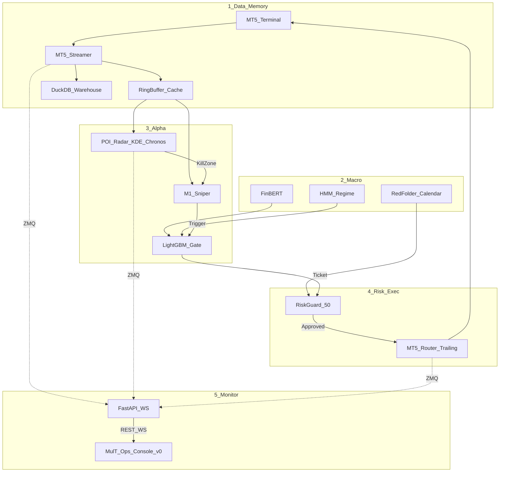

# สถาปัตยกรรมระบบ (Architecture)

> อัปเดต: 13 กันยายน 2026

## เป้าหมาย
ระบบ event-driven สำหรับบัญชีไมโคร ที่วิเคราะห์ตลาดหลายชั้น แล้วคัดกรองจนเหลือเฉพาะเซ็ตอัพคุณภาพสูงก่อนส่งออเดอร์ **0.01 lot** พร้อมโล่ขาดทุนสูงสุด **$2.50 ต่อไม้** (โมเดล Fixed-Point $50)

ฮาร์ดแวร์ออกแบบมาให้รันบน **Acer Nitro V 16** โดยให้ AI (Chronos / CNN-LSTM) ใช้ GPU แบบ batch สั้นๆ แล้วเคลียร์ VRAM ไม่ให้กระทบเกม/งานอื่นเกินเกณฑ์ ~2.5GB บน RTX 4050 6GB

## ชั้นของระบบ

## 7 Subsystems (+ ชั้นมอนิเตอร์)

| # | ชื่อ | หน้าที่สั้นๆ | เอกสาร |
|---|------|----------------|--------|
| 1 | Data Ingestion | MT5 poll + feature engineering | [data-ingestion.md](data-ingestion.md) |
| 2 | Macro & Sentiment | Calendar halt, FinBERT, HMM | [macro-sentiment.md](macro-sentiment.md) |
| 3 | POI Radar | KDE zones + Chronos quantiles | [poi-radar.md](poi-radar.md) |
| 4 | M1 Sniper | Sweep + CNN-LSTM ใน Kill Zone | [m1-sniper.md](m1-sniper.md) |
| 5 | Meta-Labeling | LightGBM `P(win) ≥ 0.75` | [meta-labeling.md](meta-labeling.md) |
| 6 | Risk Guard | กฎบัญชี $50 fixed-point | [risk-guard.md](risk-guard.md) |
| 7 | Execution | MT5 async + BE trail | [execution.md](execution.md) |
| — | Dashboard | FastAPI + v0 UI + portfolio MT5 | [dashboard.md](dashboard.md) |

## Event Bus (ZeroMQ)

- Endpoint: `tcp://127.0.0.1:5555` (PUB/SUB)
- Topics จริงใน `config/settings.py`:

| ค่าคงที่ | Topic string |
|----------|--------------|
| `TOPIC_TICK` | `market.tick` |
| `TOPIC_BAR_M1` | `market.bar.m1` |
| `TOPIC_BAR_M15` | `market.bar.m15` |
| `TOPIC_BAR_H1` | `market.bar.h1` |
| `TOPIC_KILL_ZONE` | `poi.kill_zone` |
| `TOPIC_TRIGGER_ALERT` | `sniper.trigger` |
| `TOPIC_TRADE_TICKET` | `risk.ticket` |
| `TOPIC_EXECUTION` | `exec.trade` |
| `TOPIC_SYSTEM_STATE` | `system.state` |

Dashboard (`dashboard/app.py`) subscribe topics เหล่านี้แล้ว broadcast ไปยังเบราว์เซอร์ผ่าน `WS /ws`

## Persistence

| ชั้น | เทคโนโลยี | ใช้ทำอะไร |
|------|-----------|-----------|
| Hot path | `MarketMemoryCache` (deque) | tick/bar/Kill Zone latency ต่ำ |
| Cold path | DuckDB `data/sniper_warehouse.duckdb` | bars_m1, trade_logs, kill_zones |
| Export | Parquet (`data/trades.parquet`, `bars_m1.parquet`) | weekend train / seed เมื่อ DB ถูกล็อก |
| Broker truth | MT5 `history_deals_get` | ยอดตั้งต้น + ประวัติปิดไม้บน UI |

ถ้าไฟล์ DuckDB ถูกล็อกโดย `main.py` → reader ของ dashboard ใช้ in-memory + seed จาก Parquet

## Orchestrator
`main.py` เปิดทุก worker แบบ asyncio  
เรียก MT5 / GPU ผ่าน `asyncio.to_thread()` เพื่อไม่บล็อก event loop

## Repo & Deploy
- ซอร์ส: https://github.com/PUNteerased/MulT  
- UI source: `dashboard/web` (Next.js static export)  
- UI สำหรับ Vercel: `dashboard/vercel`
